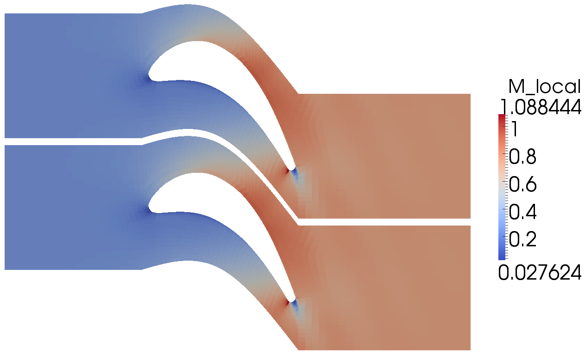

Eilmer3
=======

Eilmer3 is our principal simulation code for 2D and 3D gas dynamics.
It is a research and education code, suitable for the exploration of
flows where the bounding geometry is not too complex.

   Transonic flow through a plane turbine cascade (Kiock et al., 1986).
   Simulation by Peter Blyton, 2011.
   Visualization with Paraview.

Documententation (PDF)
----------------------
 
The full Eilmer3 User Guide and Example Book: pdf-user-guide_

.. _pdf-user-guide: ./pdf/eilmer3-user-guide.pdf

The Theory Book: pdf-theory-book_

.. _pdf-theory-book: ./pdf/eilmer3-theory-book.pdf

Slides from Fabian Zander's lecture introducing Eilmer3 to
MECH4480 students: zander-lecture-slides_

.. _zander-lecture-slides: ./pdf/mech4480_lecture.pdf

Typical build and run procedure
-------------------------------
The new 2D/3D code Eilmer3 is built from source into an installation directory ``$HOME/e3bin/``.
A typical build procedure (using the default ``TARGET=for_gnu``) might be::

  $ cd $HOME/cfcfd3/app/eilmer3/build
  $ make install
  $ make clean

Or, if you want the MPI version of the code built as well::

  $ cd $HOME/cfcfd3/app/eilmer3/build
  $ make TARGET=for_openmpi install
  $ make clean

You may need to add the installation directory to your system's 
search path to run Eilmer3.
On a recent Linux system, this could be done by adding the line::

  $ export PATH=${PATH}:${HOME}/e3bin

to the ``.bash_profile`` or ``.bashrc`` file in your home directory.

To access the Lua gas module from within the user-defined (Lua) functions,
or to use the REFPROP gas model, the following lines should also be added
to your bash configuration::

  $ export LUA_PATH=${HOME}/e3bin/?.lua
  $ export LUA_CPATH=${HOME}/e3bin/?.so
  $ export LD_LIBRARY_PATH=${LD_LIBRARY_PATH}:${HOME}/e3bin

If you wish to make use of the cfpylib functions 
from your own stand-alone Python scripts,
it may be convenient to set the PYTHONPATH environment variable::

  $ export PYTHONPATH=${PYTHONPATH}:${HOME}/e3bin/

.. _label-nonstandard-install-path:

If you choose to install eilmer3 in a different location from the
default location (``$HOME/e3bin``), then you will need to
set an environment variable called ``E3BIN`` and point it to 
the non-standard install directory. For example, if you installed
the executables and supporting scripts to: ``/work/e3bin`` then
you would set the following in your ``.bashrc``::

  $ export E3BIN=/work/e3bin
 
.. _label-openmpi-fedora:

For running on Fedora, also add the following::

  module load openmpi-i386
  # Or, for 64-bit:
  module load openmpi-x86_64

Then, try out the cone20-simple example::

  $ mkdir $HOME/work; cd $HOME/work; mkdir 2D; cd 2D
  $ mkdir cone20-simple; cd cone20-simple
  $ cp $HOME/cfcfd3/examples/eilmer3/2D/cone20-simple/* .
  $ ./cone20_run.sh  # exercise the shared-memory version of the code

or::

  $ ./cone20_run_mpi.sh  # exercise the MPI version of the code

This should generate a postscript figure of the drag coefficient history
about a sharp 20-degree cone and also put the VTK data file into the plot/
subdirectory.
It is not really necessary to make all of the subdirectories as shown above,
however, that arrangement reflects the directory tree that PJ uses.
If you want him to come and look at your simulation files when things go wrong,
use the same.
If not, use whatever hierarchy you like.

Summary of lines for your ``.bashrc`` file::

  export E3BIN=${HOME}/e3bin
  export PATH=${PATH}:${E3BIN}
  export LUA_PATH=${E3BIN}/?.lua
  export LUA_CPATH=${E3BIN}/?.so
  export PYTHONPATH=${PYTHONPATH}:${E3BIN}
  export LD_LIBRARY_PATH=${LD_LIBRARY_PATH}:${E3BIN}

Building and running on Mac OSX
-------------------------------
This is mostly the same as for a Linux machine but we provide a couple of 
specific targets::

  $ make TARGET=for_macports_gnu install
  $ make TARGET=for_macports_openmpi install

Building and running on the Barrine cluster at UQ
-------------------------------------------------
The details of running simulations on any cluster computer will be specific 
to the local configuration.  
The Barrine cluster is run by the High-Performance Computing Unit at The University of Queensland 
and is a much larger machine, with a little over 3000 cores, running SUSE Enterprise Linux.

Set up your environment by adding the following lines to your ``.bashrc`` file::

    module purge
    module load mercurial
    module load intel-cc-13
    module load intel-mpi
    export PATH=${PATH}:${HOME}/e3bin
    export LUA_PATH=${HOME}/e3bin/?.lua
    export LUA_CPATH=${HOME}/e3bin/?.so

Get yourself an interactive shell on a compute node so that you don't hammer the login node
while compiling.  
You won't make friends if you keep the login node excessively busy::

    $ qsub -I -A uq

To compile the MPI-version of the code, use the command::

    $ make TARGET=for_intel_mpi install

from the ``cfcfd3/app/eilmer3/build/`` directory.

Optionally, clean up after the build::

    $ make clean

To submit a job to PBS-Pro, which is the batch queue system on barrine, use the command::

    $ qsub script_name.sh

An example of a shell script prepared for running on the Barrine cluster::

    #!/bin/bash -l
    #PBS -S /bin/bash
    #PBS -N lehr
    #PBS -q workq
    #PBS -l select=3:ncpus=8:NodeType=medium:mpiprocs=8 -A uq
    #PBS -l walltime=6:00:00
    echo "-------------------------------------------"
    echo "Begin MPI job..."
    date
    cd $PBS_O_WORKDIR
    mpirun -np 24 $HOME/e3bin/e3mpi.exe --job=lehr --run --max-wall-clock=20000 > LOGFILE
    echo "End MPI job."
    date

This is the script input ``examples/eilmer3/2D/lehr-479/run_simulation.sh``.

Here, we ask for 3 nodes with 8 cores each for a set of 24 MPI tasks.
The medium nodes have 8 cores available, and we ask for all of them so that 
we are reasonably sure that our job will not be in competition with another job 
on the same nodes.
Note the -A accounting option.  
You will have to use an appropriate group name and you can determine 
which groups you are part of with the ``groups`` command.
Unlike SGE on Blackhole, we seem to need to change to the working directory 
before running the simulation code.
Finally, we have redirected the standard output from the main simulation 
to the file LOGFILE so that we can monitor progress with the command::

    $ tail -f LOGFILE
    
Building and running the radiation transport solver
----------------------------------------------------
While a flowfield calculation with coupled radiation can be performed via the single 
processor version of eilmer3 (e3shared.exe), the radiation transport portion of such 
calculations can often take a very long time to run.
The obvious solution is to implement the radiation transport calculation in parallel.
Due to the non-local nature of the radiation transport problem, however, for most 
radiation transport models it is necessary to implement the parallelisation via the shared 
memory multiprocessor approach.
The radiation transport solver in eilmer3 has therefore been written to make use of the
OpenMP API.
As the Eilmer3 flowfield solver does not currently support an OpenMP build, the radiation
transport solver can be built as a separate executable, e3rad.exe.

The typical build procedure for the OpenMP version of the radiation transport solver using 
the GNU compiler is::

  $ cd $HOME/cfcfd3/app/eilmer3/build
  $ make TARGET=for_gnu_openmp e3rad
  $ make clean
  
Then, try out the radiating-cylinder example::

  $ mkdir $HOME/work; cd $HOME/work; mkdir 2D; cd 2D
  $ mkdir radiating-cylinder; cd radiating-cylinder
  $ cp $HOME/cfcfd3/examples/eilmer3/2D/radiating-cylinder/* .
  $ tclsh cyl.test
  
On the barrine cluster, the Intel compiler should be used for best performance::

  $ cd $HOME/cfcfd3/app/eilmer3/build
  $ make TARGET=for_intel_openmp e3rad
  $ make clean
  
It should be noted that the e3mpi.exe executable is able to run radiation transport calculations 
in parallel when either the "optically thin" or "tangent slab" models are implemented, however a specific 
blocking layout is required for the "tangent slab" model.
See the radiatively coupled Hayabusa simulation in $HOME/cfcfd3/examples/eilmer3/2D/hayabusa for 
an example of this blocking layout.

When things go wrong
--------------------
Eilmer3 is a complex piece of software, 
especially when all of the thermochemistry comes into play.
There will be problems buried in the code and, (very) occasionally,
you will expose them.
We really do have some pride in this code and will certainly try to fix 
anything that is broken, however, 
we do this work essentially on our own time and that time is limited.

When you have a problem, there are a number of things that you can do 
to minimize the duration and pain of debugging:

#. Check the repository and be sure that you have the most recent
   revision of the code.
   This code collection is a work in progress and, in some cases,
   you will not be the only one hitting a blatant bug.
   It is likely that we or someone else has hit the same problem and,
   if so, it may be fixed already.
   The code changes daily in small ways.
   This may sound chaotic, such that you should just stay with an old version,
   however, we do try hard to not break things.
   In general, it is safest to work with the lastest revision.

#. Put together a simple example that displays the problem.
   This example should be as simple as possible so that there are not 
   extra interactions that confuse us.

#. Provide a complete package of input files and output pictures.
   We should be able to run your simulation within a few minutes
   and see the same output.

#. Be prepared to dig into the code and identify the problem yourself.
   We appreciate all of the help that we can get.

Source Code Docs
----------------
The following documentation is tentative and experimental.
Use the PDF files above; they are the primary documents.

.. toctree::
   :maxdepth: 2

   eilmer3/e3prep
   eilmer3/e3post
   eilmer3/e3history
   eilmer3/e3cgns
   eilmer3/e3_flow
   eilmer3/e3_block
   eilmer3/e3_grid
   eilmer3/cgns_grid
   eilmer3/e3_defs
   eilmer3/bc_defs
   eilmer3/flux_dict
   eilmer3/e3_render

`Doxygen documenation of C++ sources <http://mech.uq.edu.au/cfcfd/doxygen/group__eilmer3.html>`_

Other Notes
-----------
On Xserver for Linux (especially Ubuntu):

* If Paraview crashes on exporting a bitmap image, try adding the line::
  
    Option "AIGLX" "false"

  to the Section "ServerLayout" in ``/etc/X11/xorg.conf``

* To use Paraview 3.6.1 on Ubuntu 9.04 or later,
  it seems that we need to customize the look of the desktop 
  by turning off the Visual Effects. 
  This setting can be found in the System->Preferences->Appearance menu.

* To get Paraview Screenshot to behave,
  uncheck "Use Offscreen Rendering for Screenshots" button
  in the Edit->Settings ("Options") dialog.
  You will find the checkbutton under "Render View"->General.

Transferring input files between machines
^^^^^^^^^^^^^^^^^^^^^^^^^^^^^^^^^^^^^^^^^
If you find you want to transfer just the input files between
machines, ignoring the generated output files, you can do this by using the ``--exclude`` option
for the ``rsync`` command. For example, to transfer just
the input files of a directory
called ``my-sim`` on a local machine to a remote machine, use::

 $ rsync -av --exclude=flow --exclude=grid --exclude=hist --exclude=heat --exclude=plot my-sim/ remote:my-sim

If you find you are using this often, you can define an alias as appropriate for your
shell. In BASH, I add the following line to my ``.bashrc`` file::

 alias rsync-eilmer="rsync -av --progress --exclude=flow --exclude=grid --exclude=hist --exclude=heat --exclude=plot"

Then I can use do the above transfer by issuing the following command::
 
 $ rsync-eilmer my-sim/ remote:my-sim
