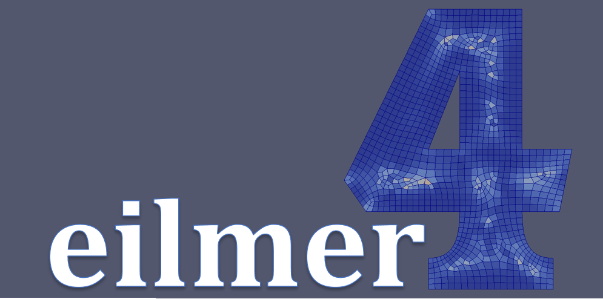

Eilmer4
=======

Eilmer4 is our latest simulation code for 2D and 3D gas dynamics.
It is a research and education code, suitable for the exploration of
high-temperature compressible flows.

   Unstructured-grid paver by Heather Muir, 2016.

Source code and Documententation
--------------------------------
 
The full Eilmer4 source code, instructions and user guides are available
from the new `home page <http://cdcfd.mechmining.uq.edu.au/eilmer/>`_ and
`Bitbucket.org repository <https://bitbucket.org/cfcfd/dgd/>`_

