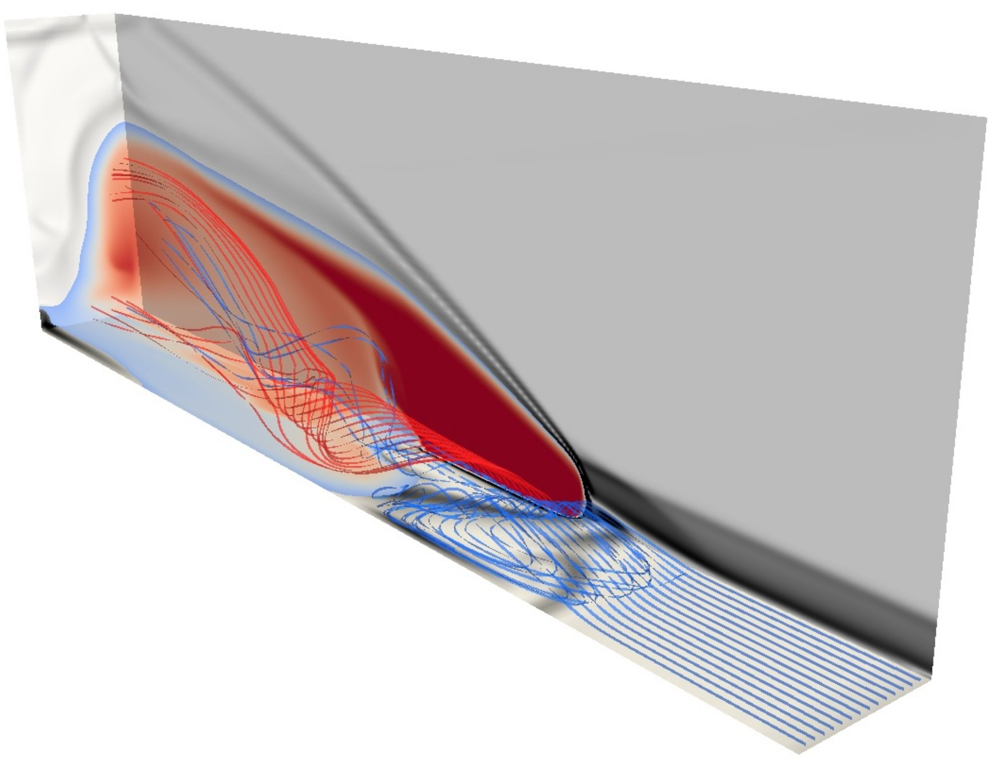

.. Compressible Flow CFD documentation master file, created by
   sphinx-quickstart on Wed Jan 25 11:33:56 2012.
   You can adapt this file completely to your liking, but it should at least
   contain the root `toctree` directive.

The Compressible-Flow CFD Project
=================================

Since the 1980s, we have been building compressible flow simulation codes.
Our goal is to make these codes into reliable simulation tools 
for high-temperature gasdynamic flows. 

   Transverse injection of hydrogen from a rectangular slot
   into a supersonic air stream.
   Simulation by Tom Marty (2012) using Eilmer3 and
   visualization by Vince Wheatley, using Paraview. 

.. toctree::
   :maxdepth: 2

   intro
   codes
   reports-and-theses
   publications-using-the-codes
   undergraduate-projects
   case-studies
   old-codes

.. comment out following bits
   Indices and tables
   ==================

   * :ref:`genindex`
   * :ref:`modindex`
   * :ref:`search`

