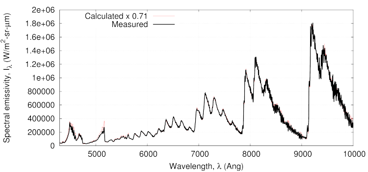
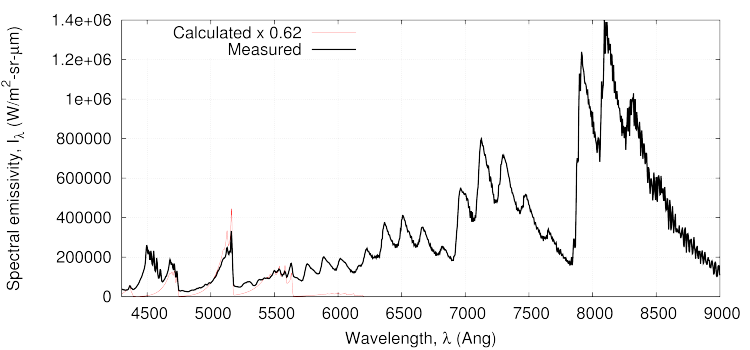
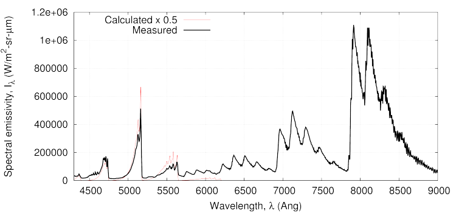
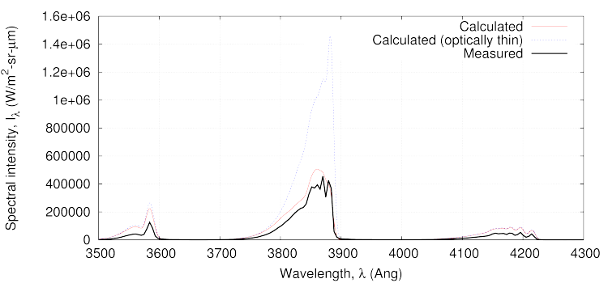

========================================================
Comparison with measured spectra from the VKI Minitorch
========================================================

.. Author: Daniel F. Potter
.. Date: Feb-2012

.. This file is a placeholder for Dan to fill in.

Description
-----------
This calculation uses the photaura spectral radiation
model to make comparisons with spectra measured in
the VKI Minitorch.  
The problem description was obtained from the TC4-2
Level 1 test case from the Third International Workshop
on Radiation of High Temperature Gases in Atmospheric 
Entry, 2008.
The document WorkshopRadiation2008-TC-4-2-Level1.pdf
gives details of the test case.

This example is found in the code collection at::

  $CFCFD/examples/photaura/TC4/
  
Files
-----

*User-built files:*

N2-CH4-gas.inp
  Input file for the 'gasfile' program to build the
  gas-model.
  
TC4-radiators.py
  Input file for 'script_rad2.py' to built the 
  radiation model.
  
TC4-validation.py
  Python script that controls the spectral 
  calculation.
   
plot_spectra.gnu
  File for 'gnuplot' to use to make the plots.
  
run.sh
  Shell script that coordinates the calculation.
  
*Output files:*

emissivities_at\_??_microns.txt
  Spectral emissivities at various spatial locations.
  
plasma-transported-intensity-optically-thin.txt
  Spectral intensity without considering absorption.
  
plasma-transported-intensity.txt
  Spectral intensity with absorption considered.

*Data files:*

exp_data/??.dat
  Experimental data measurements.
  
Running the calculation
-----------------------

The calculation is coordinated by the shell script 'run.sh'.
This can be run from the command line via:

  $ ./run.sh
  
Results
-------

The comparisons with the experimental measurements are 
shown in the figures below.
Note that the scaling factors used for the spectral 
emissivity calculations are those recommended in the 
test case.
Good agreement is shown for all spatial locations and all
spectral regions.
The plasma is seen to be an absorbing media due to the 
over estimation of the measured data when considering 
optically thin transport.

   Comparison of calculated and measured spectral emissivity at 1.24 mm from the plasma center.
   

   Comparison of calculated and measured spectral emissivity at 3.82 mm from the plasma center.
   

   Comparison of calculated and measured spectral emissivity at 8.43 mm from the plasma center.
  

   Comparison of calculated and measured spectral intensity in the wavelength range 2500 to 4300 Angstroms.
   

   Comparison of calculated and measured spectral intensity in the wavelength range 4300 to 10000 Angstroms.